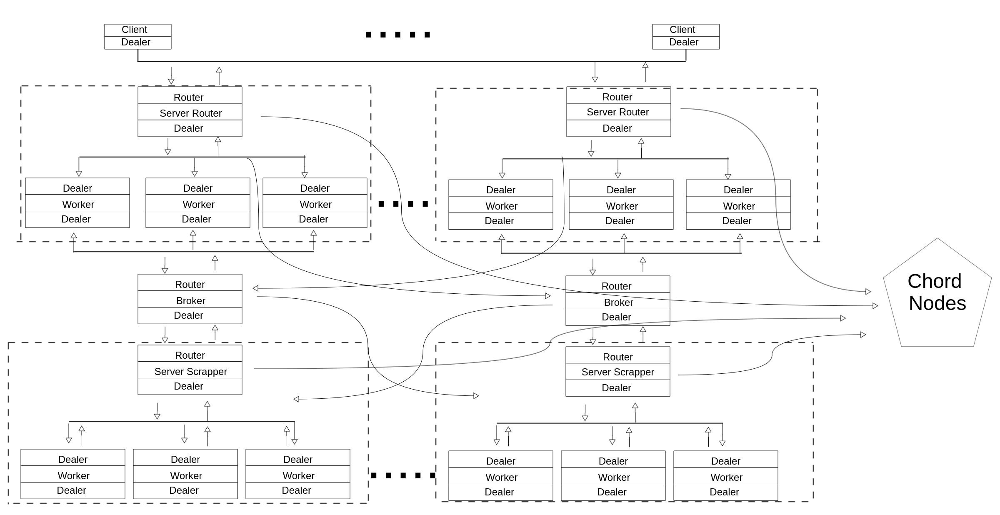

## Proyecto Final Sistemas Distribuidos

- Abel Antonio Cruz Suárez 		C411
- José Carlos Hernández Piñera  C411

 

##### Arquitectura:

Inicialmente tenemos dos _Servers Router_ a los que se conectan los clientes (pudiendo existir n, solo que por cuestión de comodidad para levantar el sistema limitamos a 2 la cantidad). En este recibimos las peticiones mediante un socket de tipo _zmq.ROUTER_. En este server están a su disposición una cierta cantidad de trabajadores, a los cuales se les distribuyen las peticiones mediante la técnica _Round Robin_. Estos trabajadores reciben peticiones de sockets _zmq.DEALER_ y reciben por sockets de ese mismo tipo también. Esta comunicación se realiza mediante _in-process_ transporte, el cual pasa mensajes a través de la memoria directamente entre subprocesos que comparten un único contexto zmq.

Entre el _Server Router_ y el _Server Scraper_ hemos colocado un broker que realiza la función de intermediario en el flujo de peticiones. 

Finalmente tenemos el Server Scraper, que al igual que el Router recibe peticiones mediante un socket _zmq.ROUTER_  y establece comunicación con sus _workers_ mediante sockets de tipo _zmq.DEALER_. Logrando el _Load Balance_ del trabajo que se le asigna a los Workers mediante la técnica FIFO.

Otra parte importante de esta arquitectura es el anillo de Chord. Este se comunica con nuestros Servers Router y Scraper para determinar la existencia de determinadas URLs. Para la creación de este sistema de Chord hemos empleado RPC.



​											**Esquema que muestra la arquitectura del proyecto**


##### Client.

La lógica del cliente es que de manera asíncrona se encuentra recibiendo y pudiendo mandar mensajes al Server Router mientras tanto. Esto se logra mediante el uso de dos hilos y de un socket de tipo zmq.DEALER que no se bloquea esperando por una respuesta. En este nodo el cliente enviará una petición y en el hilo de recibir se tiene un poll el cual esperará un máximo de 5 para saber si se tiene alguna respuesta en el socket. Una vez que se tenga se devolverá un archivo HTML.

 

##### Server Router.

El Server Router es totalmente asíncrono. Para ello se tiene un socket zmq.ROUTER (este socket de manera totalmente asíncrona enrutará lo mensajes a cualquier par conectado a él), que recibe las peticiones de los clientes. Luego se tiene un socket zmq.DEALER (este también es un socket que funciona de manera asíncrona) para establecer la comunicación con x cantidad de workers y otorgarles a ellos las peticiones que deben ser procesadas. Estos workers no son más que unos hilos que crean un socket zmq.DEALER y mediante el uso del transporte in-process se comunican con el Server Router y poseen otro socket zmq.DEALER para enviar y recibir peticiones del Scraper. Su lógica de trabajo se explica a continuación. 

El Worker necesita leer mensajes de dos tipos de sockets, de un socket zmq.DEALER, para determinar si tenemos peticiones que el Server Router envió para procesar y de otro socket zmq.DEALER, para comunicarnos con el Server Scraper y saber si se obtuvo respuesta y retornarla hacia el Server Router. Para ello se utiliza un poll. Inicialmente analizamos si ya hemos recibido información de un cliente en cuyo caso se determina si ya el HTML de la url que pide un cliente se encuentra o no en el sistema Chord. Cuando se realiza este RPC se pueden obtener varios resultados como se muestran a continuación. Un resultado que nos brinda Chord puede ser que no tiene el HTML y en dicho caso se realizará una búsqueda en profundidad a nivel 1 (se buscan los HTMLs de las URLs del mismo dominio que la URL inicial que pide el cliente). Otra respuesta puede ser que lo tiene pero no se ha hecho búsqueda en profundidad,  en cuyo caso se devuelve el HTML, pero se envía al Server Scraper la petición para realizar la búsqueda en profundidad a nivel 1. Y como última opción Chord nos puede devolver el HTML y que se ha realizado una búsqueda en profundidad a nivel 1, en ese caso solo es necesario devolver el HTML. 

Una vez que hemos realizado la interacción con el sistema Chord es necesario determinar si se obtuvo una respuesta de los Server Scraper. De ser así nos debe haber llegado un mensaje con la url scrapeada, el HTML obtenido y si se debe enviar o no al cliente este HTML. Este último argumento es necesario mantenerlo pues existe el caso en el que tenemos el  HTML de la URL en Chord y se envía al cliente, pero dicha URL no se ha analizado a profundidad 1 y se envía al Server Scraper que como respuesta inicial nos retorna el HTML de la URL, pero este ya fue devuelto con anterioridad.

Si es necesario enviar el HTML al cliente entonces se procede a enviar mediante el socket zmq.DEALER la respuesta al Server Router y este enviará hacia el cliente.

El Server Router mediante el uso de ZeroMQ Built-In Proxy Function es capaz de establecer la comunicación entre los trabajadores y los clientes. Para ello se usa zmq_proxy (frontend, backend), donde frontend representa nuestros socket zmq.ROUTER y backend el socket zmq.DEALER, ambos del Server Router. La lógica de esta función es, mediante un poll, determinar si se recibió algo del frontend, de ser así envía ese request a ser procesado al backend y luego revisa si se tiene algo del backend para ser enviado hacia el frontend. Esto es un proceso que se ejecutará en un ciclo while para siempre.

Otro aspecto a destacar del Server Router es que distribuye la carga de trabajo mediante la técnica Round Robin. La cual se ajusta perfectamente a nuestras necesidades ya que el trabajo que realizan los workers no es muy grande y prácticamente todos realizan un trabajo igual, o sea recibir peticiones, determinar si están en Chord y enviar peticiones al Server Scraper o no. Es por ello que no ocurrirá que existan trabajadores realizando trabajos más pesados que otros.

 

##### Broker.

El broker no es más que un intermediario.  El broker se une a dos puntos finales, un frontend para clientes (en este caso para los workers del Server Router) y un backend para servicios (Server Scraper). Luego usa zmq_poll () para monitorear la actividad de estos dos sockets y cuando tiene algo, envía mensajes entre sus dos sockets. Vincula cada uno de sus sockets (zmq.ROUTER para clientes y zmq.DEALER para servicios) a direcciones IP y puertos conocidos  Este broker no tienen otra función real que reducir la complejidad y los costos de escalamiento de redes más grandes.

 

##### Server Scraper.

El Server Scraper al igual que el Server Router pone en práctica la filosofía de un server que pueda atender más de una petición a la vez mediante el uso de múltiples hilos. Este Server posee un socket zmq.ROUTER  que se conecta al broker para poder obtener las peticiones de los clientes (frontend). Además posee un socket zmq.DEALER para establecer comunicación mediante transporte  in-process con los workers (backend). Como es en este nodo donde se realiza el procedimiento de scrap, fue necesario implementar una técnica más inteligente para poder distribuir el trabajo a los workers de manera balanceada. La cuestión es que una vez que se obtiene el HTML de la URL inicial, si no se ha realizado una búsqueda en profundidad a nivel 1 de las URLs del mismo dominio que puedan estar en el HTML inicial, es necesario que se busquen los HTMLs de dichas URLs. Lógicamente este es un trabajo muy costoso para ser realizado por un solo Worker, y más si existen workers en un estado Idle. Es por ello que empleamos una técnica FIFO para realizar el Load Balance entre los trabajadores. Para hacer uso de esta técnica los trabajadores envían un mensaje de "READY" cuando comienzan y después de que terminan cada tarea. El Server Scraper, que realiza una especie de función de broker, lee estos mensajes uno por uno. Cada vez que lee un mensaje, es del último trabajador utilizado. Y debido a que estamos usando un socket zmq.ROUTER, obtenemos una identidad que almacenamos en una estructura Queue de la biblioteca queue.

El módulo queue implementa colas multi-productor y multi-consumidor. Es especialmente útil en la programación en hilo cuando la información debe intercambiarse de forma segura entre varios subprocesos. La clase Queue de este módulo implementa toda la semántica de bloqueo necesaria.

Una vez que tenemos algún trabajador en nuestra cola permitimos hacer poll en el frontend para obtener nuevas peticiones de los clientes. Estas peticiones son procesadas en un método en el cual primeramente obtenemos el HTML de de la URL enviada por el cliente, luego haciendo uso de la biblioteca bs4, con BeautifullSoup realizamos un pareseo sobre el HTML obtenido y con las URLs del dominio que se encuentren procedemos a distribuirlas de manera balanceada para que los workers obtengan cada uno de los HTMLs correspondientes. Para esto revisamos si en una cola ya tenemos URLs para obtener su HTML, de ser así extraemos el primer Worker que se liberó de su trabajo y mandamos un mensaje a ese Worker con el trabajo que debe realizar.

Cuando un mensaje es enviado a un Worker su primera acción antes de scrapear la URL es comprobar si esta existe o no en Chord, pues de otra forma  pudiéramos pasar el trabajo de scrapear la URL para obtener el HTML habiéndolo tenido de antemano. En caso de no tenerlo se procede a scrapear su HTML y se guarda en Chord, con profundidad 0, pues no hemos buscado las URLs del mismo dominio de la que se está analizando. Y al terminar se envía un mensaje a Server Scraper indicándole que ya ha concluido y se puede insertar nuevamente en la cola de workers idle.

##### Sistema Chord.

Nuestro sistema de Chord es el ya estudiado en las conferencias. Donde se tiene nodos que almacenan en un diccionario las los HTMLs de las URLs que les corresponden en dependencia de su id. Para determinar si una determinada URL se debe almacenar en un determinado nodo se realiza un hash sobre la URL y el número obtenido le aplicamos aritmética mod $2^m$ ($m$ es la máxima longitud del identificador). Esta operación nos otorga el nodo donde debería estar almacenado el HTML. Para proceder a insertar buscamos un nodo cualquiera de Chord y hacemos una búsqueda del nodo al que pertenece mediante el RPC _LookUp(x)_ esto nos devolverá el propio nodo x o el sucesor de x.

 Para evitar que el algoritmo Join de forma constante intente arreglar laf finger tables de todos los nodos a medida que evoluciona la red, es necesario un cambio en la estrategia de actualización de predecesores sucesores y las finger tables. Para esto se utiliza un protocolo de estabilización para mantener los punteros sucesores de los nodos actualizado, lo cual es suficiente para garantizar la exactitud de las búsquedas.

Esos punteros sucesores se utilizan para verificar y corregir las entradas a la finger table, lo que permite que las búsquedas sean rápidas y correctas.

Cada nodo ejecuta la estabilización periódicamente (así es como los nodos son notados por la red). Cuando el nodo n se Estabilize, pregunta al sucesor de n por el predecesor del sucesor p, y decide si p debería ser el sucesor de n. Esto sería el caso si el nodo p se unió recientemente al sistema. Estabilize también notifica al sucesor del nodo n de la existencia de n, dando al sucesor la oportunidad de cambiar su predecesor a n. El sucesor hace esto solo si no conoce un predecesor más cercano que n.

Como un ejemplo simple supongamos que el nodo _n_ se une al sistema y su _id_ se encuentra entre $n_p$ y $n_s$. $n$ adquirirá a $n_s$ como sucesor. El Nodo $n_s$ cuando sea notificado por $n$ (método Notify), adquirirá a $n$ como su predecesor. Cuando $n_p$ corra Stabilize le preguntará a $n_s$ por su predecesor, que es ahora $n$, y $n_p$ adquirirá a $n$ como su sucesor. Finalmente $n_p$ invocará el método Notify y $n$ adquirirá a $n_p$ como su predecesor. Llegados a ese punto todos los sucesores y predecesores están correctos.

Tan pronto como los punteros del sucesor sean correctos, las llamadas a FindPredecessor (y por lo tanto FindSuccessor) funcionarán. Los nodos  recién unido que aún no han sido puestos en Finger Table pueden hacer que FindPredecessor inicialmente falle, pero el bucle en el algoritmo de búsqueda, no obstante,

sige los punteros del sucesor (fingerTable [1]) a través de los nodos recientemente unidos hasta que se alcance el predecesor correcto. Finalmente fix_fingers ajustará las entradas de la fingerTable, eliminando la necesidad de estos escaneos lineales.

Para la tolerancia a fallas mantenemos una lista de posibles sucesores de un nodo que se actualiza cada vez que en el método Stabilize se encuentra un sucesor. En caso de que al hacer un llamado al succesor ocurra un ConnectionError. Entonces mediante un decorador (recover_from_failure) procesamos dicha excepción quitando de la lista de sucesores el que no nos es posible comunicarnos y tomamos el próximo de la lista. De esta forma en el peor de los caso, cuando no nos quedan más sucesores tenemos como último sucesor al nodo en sí.


##### Puntos Fuertes de la arquitectura:

- Como es posible observar se entre el cliente y el Server Router, el Server Router y el Broker, el Broker y el  Server Scraper y los workers con los Servers Scraper y Servers Router establecen conexión mediante el patrón DEALER  para obtener la combinación de sockets más potente, que es un DEALER hablando con ROUTER. Nos da clientes asincrónicos que hablan con servidores asincrónicos, donde ambos lados tienen control total sobre los formatos de los mensajes. Esta  asincronía es aplicada donde quiera que se establezca una comunicación DEALER-ROUTER o DEALER-DEALER en nuestra arquitectura y como todas las comunicaciones se hacen mediante estos patrones solamente, podemos presumir de tener un Scraper distribuido totalmente  asíncrono. 

- Al trabajar entre DEALER y ROUTER se nos da la posibilidad de manipular en un mayor alcance la información que se transfiere entre dichos sockets. Un ejemplo de ello es como fue necesario trabajar con las identidades de los workers en el Server Scraper para poder insertarlos en la cola de workers idle.
- En la arquitectura se está haciendo un diálogo DEALER to ROUTER entre varios nodos (ejemplo cliente y Server Router), pero internamente entre el hilo principal del servidor y los workers, estamos haciendo DEALER to DEALER. Si los trabajadores estuvieran estrictamente sincronizados, usaríamos REP. Sin embargo, debido a que queremos enviar múltiples respuestas, necesitamos un socket asíncrono. No es necesario enrutar las respuestas, ya que siempre van al hilo del servidor único que nos envió la solicitud.
- Para lograr un load balance efectivo en el Server Scraper y distribuir la carga de forma eficiente a sus workers se puso en práctica la técnica de First In First Out, que presenta resultados más favorables que Round Robin para este caso. Esto se debe a que con Round Robin pudiéramos estar distribuyendo las cargas de forma tal que uno o varios workers obtengan trabajos más pesados y otros más sencillos y se queden libres, mientras existan algunos con más carga pesada. También puede ocurrir que obtener algunos HTMLs sea menos costoso que otros y estos menos costosos se quedaría atascado esperando por que se resuelvan HTMLs más grandes.
- En el Server Scraper no es necesario poner en práctica una técnica de balanceo más complicada y difícil de poner en práctica como FIFO, y en cambio se usa Round Robin, más sencilla y fácil de manipular en caso de imperfecciones. Esto se debe a que los trabajos son muy livianos, pues solo sería determinar si existe la petición en Chord y en dependencia enviar la URL al Server Scraper.
- El uso de un broker hace que nuestra arquitectura en la sección entre el Server Router y el Server Scraper sea más fácil de escalar porque los clientes (Server Router) no ven a los Servers Scraper y los Servers Scraper no ven a los clientes. El único nodo estático es el intermediario. Sin esta estructura tendríamos que decir explícitamente a los Servers Router a que Servers Scraper conectarse. De forma tal que si hoy nos conectamos a 5 pero mañana existen 100 más a los que es necesario conectarse, tendríamos que de manera manual conectar los Servers Router a cada una de las nuevas direcciones de los 100 nuevos Servers Scraper. Con el broker es posible conectar una infinidad de clientes y de servicios sin preocuparnos por establecer conexiones. Además que como este broker utiliza un socket Router para clientes y un Dealer para servicios entonces funciona de manera asíncrona evitando cuellos de botella.
- Para establecer comunicación con Chord se usa RPC lo cual permite abstraernos de la comunicación o la labor de empaquetamiento necesaria, que se establece entre los nodos de Chord y los de la arquitectura, pareciendo como si realmente estuviéramos llamando a un proceso interno de la aplicación. 
- El sistema 

 

##### Puntos Débiles de la arquitectura: 

- Al trabajar con una arquitectura totalmente asíncrona nos enfrentamos a problemas como: La memoria compartida, lo cual puede acarrear a resultados inesperados, o que el procesos de determinar donde ocurre determinado error (debuguear suele ser muy difícil de realizar). Otros problemas pueden ser race condition, deadlocks, dead by starvation. Algunos de estos siendo algunas veces difíciles de determinar cuando están ocurriendo, pues no siempre pueden ocurrir. Es por ello que al usar este tipo enfoques es necesario el desarrollo de una aplicación los más sencilla posible. Se pudiera haber usado un enfoque multiprocesos, ya que cada procesos tienen su propio espacio de memoria y el acceso a los recursos de forma concurrente no trae consecuencia alguna. Pero levantar un proceso es mucho más costoso, los mecanismos de comunicación entre procesos son caros y el cambio de contexto es caro y puede incluir intercambio entre memoria y disco duro. En cambio usar hilos es de mayor beneficio para nuestra arquitectura pues no existen casi puntos de concurrencia y los hilos son menos costosos de crear.
- Existe en nuestra arquitectura un punto estático constituido por los brokers. Esto es un problema ya que si se perdieran todos los brokers queda totalmente particionada la arquitectura, sin posibilidad de establecer comunicación. Sin embargo nos es beneficioso su uso pues permite una mayor escalabilidad, ya que podemos tener un cliente conectado a infinidad de servicios.
- Existe un flujo de información elevado entre el Server Scraper y el sistema de Chord con el propósito de determinar si ya se posee determinado HTML, pero este es necesario para evitar la tarea de Scrapear la URL si ya se tiene el HTML.

##### Flujo del sistema

La arquitectura diseñada consiste en 2 Servers Router, encargados de recibir peticiones a través de un socket de tipo zmq.ROUTER.  Dentro de este server tenemos unos trabajadores a los que de manera asíncrona se les distribuyen las peticiones de los clientes. Estos workers que tenemos establecen conexión con el Server Router a través de un socket de tipo zmq.DEALER. Una vez llegada la petición a un Worker intentamos establecer conexión con el sistema Chord mediante RPC, usando PYRO, en aras de determinar si ya se tiene el HTML de la URL en cuestión. De no poseer dicho HTML entonces es necesario enviar una petición a los nodos Scraper (Server Scraper), que se hace mediante un socket de tipo zmq.DEALER,  para obtener el HTML y otros HTMLs que se obtienen a partir de buscar las URLs que se encuentran en el HTML de la primera URL. 

Esta petición se le envía a un Broker que la recibe mediante un socket de tipo zmq.ROUTER y luego el Broker la envía al Server Scraper mediante un socket de tipo zmq.DEALER.

Una vez que la petición llega al Server Scraper, mediante un socket zmq.ROUTER, se obtiene su HTML y se envía esta respuesta todo el camino hacia atrás. Luego se procede a buscar las URLs del mismo dominio que la URL inicial. Una vez que han sido encontradas se procede a enviar cada una de dichas URLs a los trabajadores disponibles, para obtener su HTML. Estas se envían usando un socket de tipo zmq.DEALER y es empleada la técnica de load balance mediante FIFO (se explican con más detalles adelante). Los trabajadores poseen unos sockets de tipo zmq.DEALER con los cuales reciben las peticiones, luego realizan una comunicación con el sistema CHORD para determinar si existe el HTML de la URL y evitar realizar el scrapeo de dicha URL. En caso negativo se scrapea la URL y se envía la respuesta al Server Scraper mediante un socket de tipo zmq.DEALER.  

##### Docker

Para realizar un testing adecuado de la aplicación realizada e incluso asegurar un ambiente seguro en un entorno de producción, utilizamos _docker_ como herramienta que garantiza dichas cuestiones. Nos apoyamos en una imagen de python:3.7, no empleamos un alpine debido a que una de las bibliotecas que se utilizaron durante la realización del proyecto fue _zmq_, la cual posee integraciones en C y una imagen alpine de python, según nuestas indagaciones, no es adecuada para este tipo de extensiones; debido a que faltan encabezados del lenguaje. Brindamos a continuación, de cualquier forma, un Dockerfile que se pudiera emplear para la solución del problema en cuestión; agregando que no aseguramos el correcto funcionamiento del mismo, ya que no tuvimos oportunidad de probarlo. (por problemas de conectividad)

```dockerfile
FROM alpine:edge

RUN apk update && apk add build-base libzmq musl-dev python3-dev zeromq-dev

RUN pip3 install pyzmq

RUN pip3 install Pyro4

RUN pip3 install requests

CMD ["/bin/sh"]
```


En los archivos del proyecto exponemos el Dockerfile y el docker-compose.yml utilizados.

Antes de proceder a la ejecución del entorno de docker se hace necesario la creación de una red de docker (red de tipo bridge) que nos asegurará que todos los contenedores se encuentren bajo el mismo rango de IPs y que se pueda llegar de uno al otro.
Para la creación de la red se emplea el siguiente comando:

 **docker network create --subnet 10.0.0.0/24 chord-net**.

Con un ligero repaso al docker-compose se puede chequear que los primeros servicios que se depliegan son los _brokers_ y los _nodos de scrappeo_, los cuáles son una pieza fundamental a la hora del correcto funcionamiento del proyecto y además ofrecen alternativas de rendimiento y escalabilidad. También ejecutamos al inicio el _name-server_ (ns) de _Pyro_, herramienta que ayuda a tener localizadas las _uri_ del resto de nodos del sistema y por tanto brinda facilidades a la hora de efectuar _RPC_ dentro del mismo. Todos estos aspectos técnicos de _brokers_, _scrappers_, _routers_, etc, se explican en las demás partes del informe que se presenta.

Notar que todos los contenedores se reiniciarán de forma automática en caso de que ocurra un fallo dentro de los mismos.

En definitiva, exponemos a continuación, todos los pasos a seguir para ejecutar el ambiente de docker. [La terminal donde se ejecuten los mismos debe estar situada en la raiz del proyecto]
```bash
1. docker network create --subnet 10.0.0.0/24 chord-net 
2. docker build -t jch/chord .
3. docker-compose up -d
4. docker exec -it chord-node-{1-10} bash
	4.1 python src/"file-to-run[ChordNodes/Clients]"
```